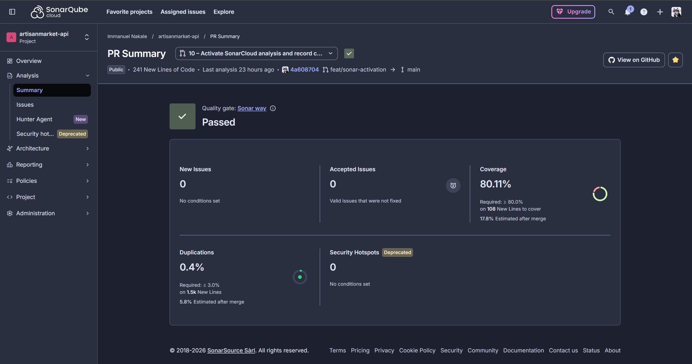

# Quality gate configuration

**Decision date:** 2026-10-01 · **Status:** passing on the default gate

The Code stage treats SonarQube as a **gate**, not a reporting step:
`sonar.qualitygate.wait=true` makes the scanner wait for the server-side result
and fail the build when it is `ERROR`. Without it the step uploads findings and
passes regardless — which is how a Security rating of **E** sat next to a green
pipeline on this project's first Sonar run.

## Result

The project passes SonarCloud's **unmodified default gate**, *Sonar way*:

| Condition | Threshold | Achieved |
|---|---|---|
| `new_security_rating` | A | **A** |
| `new_reliability_rating` | A | **A** |
| `new_maintainability_rating` | A | **A** |
| `new_coverage` | ≥ 80% | **80.1%** |
| `new_duplicated_lines_density` | ≤ 3% | **0.4%** |
| `new_security_hotspots_reviewed` | 100% | **100%** |

No condition was relaxed and no paid feature was used.

> **Screenshot pending — `screenshots/sonar-gate-passed-api.png`.**
> *SonarCloud quality gate, `artisanmarket-api` PR #10 — all six conditions green on the default Sonar way gate.*
> Capture instructions are in `screenshots/README.md`. Once the file is
> committed, delete this block and uncomment the embed below it.

<!--  -->
<!-- *SonarCloud quality gate, `artisanmarket-api` PR #10 — all six conditions green on the default Sonar way gate.* -->

### Why not a custom gate

A custom gate — *Sonar way* without the coverage condition — was the original
plan, and was **abandoned on cost**. SonarCloud restricts assigning any gate
other than the default to paid plans, and this project is bound by the
open-source and free-tooling constraint in Section 7.2 of the proposal.

That constraint produced a better outcome than the plan it blocked. Rather than
documenting a weakened gate, the project meets the standard one. The claim
"passes the default SonarQube quality gate" is materially stronger than "passes
a gate we modified".

Worth recording as a finding about tool selection: a free-tier hosted scanner
constrains engineering decisions in ways its feature list does not advertise,
and the constraint only surfaced at the point of trying to act on it. The
alternative preserving custom gates within budget is self-hosted SonarQube
Community Edition, at the cost of running a server reachable from CI.

## Reaching 80% coverage

The project had no tests when SonarQube was wired in, so `new_coverage` was 0%.

| Stage | Coverage |
|---|---|
| No tests | 0% |
| Unit tests on the sanitisers and error handler | 56.2% |
| Route integration tests | 66.9% |
| Import smoke tests | 69.9% |
| Upload filter and vendor mass assignment | 74.4% |
| Remaining route paths | 77.8% |
| Targeted tests on the last uncovered lines | **80.1%** |

> **Screenshot pending — `screenshots/sonar-coverage-api.png`.**
> *Coverage on New Code, `artisanmarket-api` PR #10 — 80.1% against the 80% threshold.*
> Capture instructions are in `screenshots/README.md`. Once the file is
> committed, delete this block and uncomment the embed below it.

<!--  -->
<!-- *Coverage on New Code, `artisanmarket-api` PR #10 — 80.1% against the 80% threshold.* -->

**102 tests across 7 files.** They assert security properties rather than
chasing lines — that an injected operator cannot change what a query matches,
that a catastrophic regex is matched literally, that card numbers never reach a
log, that a token signed with the wrong secret is rejected. A regression that
reintroduces a vulnerability fails the build here rather than only being
re-reported by the scanner.

The final tests were written against exact line numbers read from the lcov
report, not guessed.

### What the suite caught

Writing it was not bookkeeping. It found three things that code review had
missed:

1. **The redaction bug.** `middleware/errorHandler.js` compared whole keys
   against a camelCase list while lowercasing the key, so `cardNumber` became
   `cardnumber`, never matched, and **card and account numbers were still being
   written to the log** after the fix that was supposed to stop it.
2. **A second server coupling.** `routes/vendorBankRoutes.js` imports
   `{ plaidClient }` from `server.js`, so two routes boot the whole application
   on import — not one, as a manual search had concluded.
3. **A local auth implementation.** `routes/vendorRoutes.js` defines its own
   `requireAuth` using `jwt.verify` instead of importing the shared middleware,
   so mocking the middleware module had no effect on it.

### Testability findings

1. **Modules fail closed at import time.** `utils/encryption.js` and
   `config/secrets.js` call `process.exit(1)` without their secrets. Correct —
   it is the threat T3 remediation — but anything importing them needs values
   present, which `tests/setup.js` generates per run.
2. **Two routes import `server.js`**, so importing either boots the application:
   `connectDB()`, the secret assertions and a listening socket. Stubbed at the
   test boundary rather than refactored; recorded here as a design issue.
3. `tests/setup.js` was initially analysed as production source, because
   `sonar.test.inclusions` only matched `*.test.js`. It contributed six
   uncovered lines before the pattern was widened to `tests/**/*`.

### Known limitation

Eleven changed lines in `server.js` remain uncovered — request logging, the CORS
origin check and the Socket.IO handler. Covering them means extracting the
request-logging middleware into its own module. That is a reasonable
improvement, but it was not done here: the 80% threshold was met without it, and
refactoring the entrypoint purely to satisfy a metric is the wrong reason to
touch a working boot path.

## Known false positives, marked in SonarCloud

Two `jssecurity:S5147` (NoSQL injection, BLOCKER) findings at
`routes/authRoutes.js` are marked **False Positive**. Marking issues is
available on the free tier; only custom gates are not.

They are not exploitable. The value reaching the Mongoose filter is guarded by
`typeof email === 'string'`, so `{ $ne: null }` becomes `undefined` and the
filter matches nothing. Both routes additionally run `express-validator`'s
`isEmail()` ahead of the query, and `tests/routes.integration.test.js` asserts
directly that an operator object cannot authenticate.

Three forms were tried before concluding this: the raw value, a shared
`asString()` helper, and an inline `typeof` guard. Sonar reported the flow in
every case — **its taint analysis does not track sanitisation through a type
guard or a custom function.** Further restructuring would have made the code
worse to satisfy a tool rather than to improve security.

This is a reportable result in its own right: SAST false positives survive
correct remediation when the analyser cannot see the sanitiser, and a process
requiring every finding to reach zero will eventually pressure engineers into
contorting working code.
